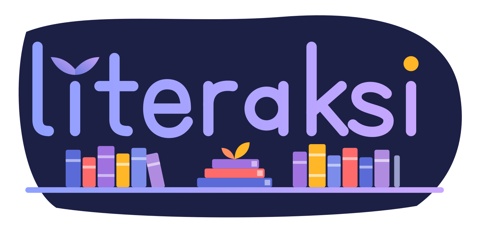

# LITERAKSI: Baca, Pahami, Beraksi

<p align="center">
  
</p>

<p align="center">
  Aplikasi manajemen peminjaman buku perpustakaan sekolah dengan antarmuka yang estetik dan mudah digunakan.
</p>

<p align="center">
<a href="https://github.com/manggalaputraaji/LITERAKSI"></a>
<a href="LICENSE"></a>
<a href="https://github.com/manggalaputraaji/LITERAKSI/Issues"></a>
</p>

## Tentang Proyek

LITERAKSI adalah aplikasi manajemen peminjaman buku yang dirancang untuk membantu pengelolaan perpustakaan sekolah menjadi lebih teratur, cepat, dan nyaman. Aplikasi ini berfokus pada pencatatan buku, data peminjam, serta aktivitas peminjaman dalam satu pengalaman yang sederhana dan modern.

Proyek ini dikembangkan sebagai solusi digital untuk mengurangi pencatatan manual dan memberikan pengalaman pengelolaan perpustakaan yang lebih baik bagi petugas maupun siswa.

## Nilai Utama

- Pencatatan peminjaman yang praktis dan rapi.
- Alur kerja yang sesuai dengan kebutuhan perpustakaan sekolah.
- Antarmuka yang bersih, estetis, dan mudah dipahami.
- Fondasi yang dapat dikembangkan untuk katalog, anggota, dan laporan.

## Fitur

### Saat ini dan dalam pengembangan

- [ ] Pengelolaan katalog buku dan ketersediaan.
- [ ] Data siswa atau anggota perpustakaan.
- [ ] Pencatatan peminjaman dan pengembalian.
- [ ] Informasi batas waktu dan keterlambatan.
- [ ] Pencarian dan penyaringan data.
- [ ] Dasbor aktivitas peminjaman.
- [ ] Tampilan responsif untuk berbagai ukuran layar.
- [ ] Ekspor laporan peminjaman.

> Daftar fitur dapat berubah seiring perkembangan proyek.

## Teknologi

Teknologi yang digunakan akan diperbarui setelah implementasi aplikasi tersedia. Badge berikut disiapkan sebagai bagian dari dokumentasi proyek dan dapat disesuaikan dengan stack final.

<p>
  
  
  
  
  
  
</p>

## Demo dan Pratinjau

Bagian ini akan menampilkan tampilan aplikasi setelah screenshot tersedia.

### Dasbor


### Pencatatan Peminjaman


## Memulai Pengembangan

LITERAKSI masih berada dalam tahap awal pengembangan. Panduan berikut akan dilengkapi setelah source code dan konfigurasi proyek tersedia:

1. Persyaratan sistem.
2. Instalasi dependensi.
3. Konfigurasi environment variable.
4. Menjalankan aplikasi secara lokal.
5. Menjalankan pengujian dan build produksi.

## Struktur Proyek

Struktur direktori akan didokumentasikan setelah source code utama ditambahkan ke repository.

```text
LITERAKSI/
├── assets/
│   └── screenshots/
├── logo.png
├── README.md
└── LICENSE
```

## Status Proyek

LITERAKSI merupakan proyek aktif yang masih dalam tahap awal. Arsitektur, fitur, dan dokumentasi dapat berkembang sesuai kebutuhan pengembangan.

## Kontribusi

Saran dan kontribusi sangat terbuka. Jika ingin berkontribusi:

1. Buka issue untuk menjelaskan masalah atau usulan.
2. Buat branch khusus untuk perubahan yang dikerjakan.
3. Gunakan commit yang jelas dan terfokus.
4. Buat pull request dengan deskripsi perubahan yang lengkap.
5. Sertakan screenshot jika perubahan memengaruhi tampilan.

Sebelum membuat issue baru, silakan periksa issue yang sudah tersedia untuk menghindari duplikasi.

## Lisensi

LITERAKSI didistribusikan di bawah [GNU General Public License 3.0](LICENSE).

## Pengembang

Dibuat dan dikelola oleh [manggalaputraaji](https://github.com/manggalaputraaji).

---

<p align="center">
  Dibuat untuk menjadikan pengelolaan peminjaman buku sekolah lebih sederhana, rapi, dan nyaman.
</p>
